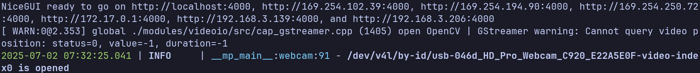

# iQ-VLM-DEMO


## Prerequisites

* A running **OGenie server**.
  > not publicly available, please contact us for access
* A **webcam** connected to the **Qualcomm platform**. (1920x1080 MJPG 30 FPS)

## Steps on the Qualcomm Platform

1. **Clone the repository**

   ```bash
   git clone https://github.com/aiotads/iQ-VLM-DEMO.git
   cd iQ-VLM-DEMO
   ```

2. **Build the Docker image**

   ```bash
   docker build -t iq-vlm-demo -f docker/Dockerfile ./
   ```

3. **Run the demo**

   ```bash
   ./docker/run.sh
   ```

   

4. **Open `192.168.3.206:4000` using your web browser**
